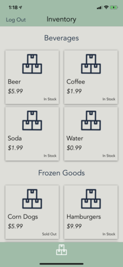
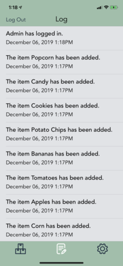
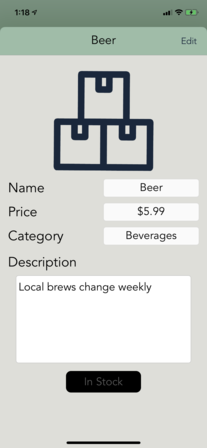

# Catalogue   Product Inventory Application

Catalogue is an iOS application used to view a business\' product catalogue and availability.
 
It allows the users to create an inventory of items and modify whether they are in stock or not.
 
The app also logs any events such as admin sign on, new items or item deletions.
 

## Getting Started

The application does not require any initial setup.

## Database Design

## Mockup

 

 

 

## Authors

| Name             | Github                                              |                           Email     |
| -------------    | --------------------------------------------------- | ----------------------------------- |
| Jonathon Bauer   | [jonathonbauer](https://github.com/jonathonbauer)   | jonathon.bauer01@stclairconnect.ca  |

## Credits

Application Design: [Stephanie Markert - Graphic Designer](https://stephdesigns.ca)
 
Explosion Sound: [V-ktor](https://freesound.org/people/V-ktor/sounds/482992/)
 
Paper Sound: [Anthousai](https://freesound.org/people/Anthousai/sounds/398897/)
